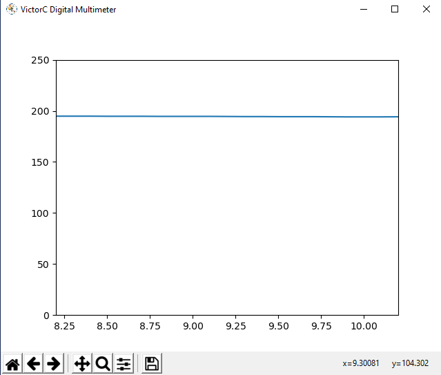

# Victor 70C Digital Multimeter python tools

The application included with the Victor 70C Digital Multimeter (DMM) has many issues and is very outdated.
I figured that a set of python tools to read from the Victor 70C would be a fun project to learn python.

It would seem logical that someone using a DMM for testing might want to be able to create a simple script to link into a more comprehensive set of test procedures.

## Features

* Cross platform (should run on Linux, Mac, Windows)
* Save data to CSV file either continuously or via the space bar
* Plot the data in real time

## Victor 70C data protocol and structure

Probably the most important part of this code is the parsing of the Victor 70C data from the serial port.
The Victor 70C and some other DMMs with serial output use the FS9922-DMM4 integrated circuit.
The documentation for the data protocol and structure can be found here (PDF):
[FS9922-DMM4 Datasheet](https://www.ic-fortune.com/upload/Download/FS9922-DMM4-DS-13_EN.pdf)

The `parse_victor70c.py` script takes in a line read from the Victor 70C and returns a dictionary with the signed values and units. I suspect that more experienced python programmers would just use this parser and create their own script to integrate the results into their workflow.

## Installation

I am just starting to learn python. All my tests have been using Python 3. I have no idea if this code works with other python versions.

`parse_victor70c.py` does not have any requirements or imports

`plot_victor70c.py` requires the following modules:

* serial (pyserial)
* serial.tools.list_ports (pyserial)
* keyboard
* argparse
* datetime
* csv
* matplotlib

## Usage

```markdown
usage: plot_victor70c.py [-h] [-p PORT] [-f FILE] [--continuous] [--plot]
                         [--ymin YMIN] [--ymax YMAX]

Record data from VictorC Digital Multimeter

optional arguments:
  -h, --help            show this help message and exit
  -p PORT, --port PORT  Select serial port eg. COM2 or /dev/ttyS0
  -f FILE, --file FILE  Choose filename for csv file
  --continuous          Enable to continuously record data to csv file. If not
                        enabled use spacebar to record data points.
  --plot                Enable to plot data in separate window.
  --ymin YMIN           Y minimum for plot
  --ymax YMAX           Y maximum for plot
```

Examples

The following command connects to COM2, saves data to 'data.csv' and records data continuously (every second):

`python plot_victor70c.py --port COM2 --file=data.csv --continuous`

Matplotlib can be used to plot the data in real-time (barely working...)

`python plot_victor70c.py --port COM2 --file=data.csv --plot --continuous --ymin=0 --ymax=250`



## Victor 70C Quick Start Tips

The serial port uses the CP2101 serial to USB converter. Make sure you have the drivers installed and that the device shows up when plugged into the USB port. Turn on the data output be holding down the `REL/RS232` button until it beeps (2 seconds). The baud rate is 2400.
